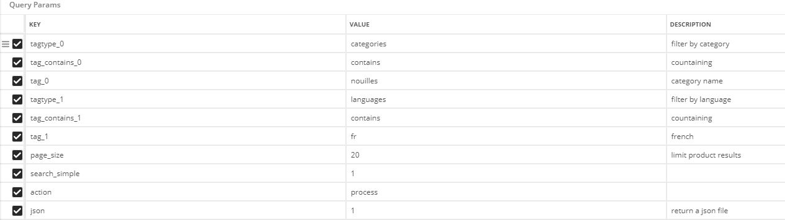

# openfoodfacts
P5 Openclassrooms : "Utilisez les données publiques de l'OpenFoodFacts"

## Specifications
### User story description:

System asks:

Would you like to see already substituted foods ? y/n  
If user press "y", systems shows him all substituted foods.  
Then, or if user answers "n", system asks following questions to user:

* Please select a category (several options identified by a number). User type chosen number (corresponding to wanted category) and press "enter".
    * Please select food (several options identified by a number). User type chosen number (corresponding to wanted food) and press "enter".
    
System proposes a substitute of chosen food, its description, where to buy it (if available) and a description link.
User may choose to save this substitute in database.

User can quit the interface when he wants by answering "q" to any question.

 
### Functionalities

* Food search in Openfoodfacts database.
* User interact with system in terminal
* If user type unexpected character (anything other than a number), system will ask the question again.
* Search is applied on a Mysql database.

### Requirements
You need to create a config.py file (at the root) with your Mysql database credentials like this template:  
  

HOST='ip_address_of_the_mysql_server'  
DATABASE='database_name'  
USER='your_user'  
PASSWORD='your_password'

### Openfoodfacts API request parameters

### Program description
This program is working with a "P5" Mysql database with "category", "product", and "substituted" tables.
User must specify the food categories (existing in openfoodfacts) he wants to explore in: "categories.txt"

1. The program checks if the database contains expected tables. If not, existing database is erased and rebuild
1. The program compares the content of the table "category" with "categories.txt". If it doesnt match, existing tables are erased and rebuild.
1. The programm fill the "product" table for each category (after checking if expected data is available and meet standard) based on openfoodfacts API request
1. The program provide a user interface in terminal to let user browse categories / products and decides if he wants to record any substitution in "substituted" table.

    
